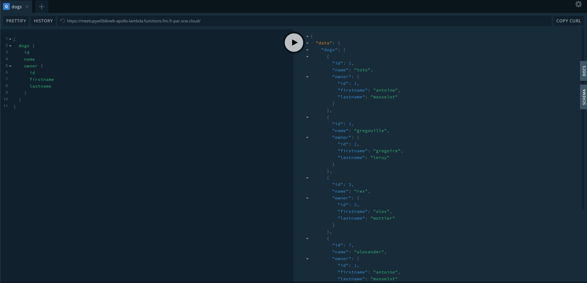

# node.js GraphQL with TypeScript
This repository includes a simple example about how to use Scaleway Functions with node.js runtime to manage a GraphQL Endpoint with Apollo Server (for AWS Lambda) and TypeScript.

What this kit does:
- Simple query to list `dogs`, `owners` and the relations between these entities (each dog belongs to an owner, therefore each owner has 0 or multiple dogs).
- Simple mutations to manage dogs and owners (right now, only create and delete dog).



## Requirements

In order to start development with this kit you need:
- node.js and npm (node version 8 or 10)
- [ncc](https://github.com/zeit/ncc) installed (CLI to build/run JavaScript/TypeScript files with Webpack)
- [Serverless CLI installed](https://serverless.com)
- a MySQL database (version 5.6) running somewhere

### Run the example

First, you need to import Database's schema, which can be found in [this file](./db.sql) (import it to your database).

The example uses the following environment variables in order to work properly:
```
DB_HOST="host.database.com"
DB_USER="database-user"
DB_PASSWORD="database-password"
DB_NAME="your-database-name"
```

You may use the following commands:
```bash
# Build the project from TypeScript to JavaScript
bash build_handlers.sh
```

Once your code has been compiled to JavaScript (inside folder `dist`), you may compress all three files (`handler.js`, `db.js` and `schema.js`).
Then, rename the archive `function-<function-id>` (function-id represents the ID of the function you created with a `node.js` runtime inside Scaleway's API).

**We're using the Serverless Framework to deploy our functions to Scaleway Serverless Platform**: [Documentation for Serverless-Framework implementation for Scaleway Platform](https://github.com/scaleway/serverless-scaleway-functions).

You need to:
- Get credentials on Scaleway Platform and export them via Environment Variables (follow the Serverless-framework documentation linked above):
  ```bash
  export SCW_TOKEN="<your-token>"
  export SCW_ORGANIZATION="<your-organization>"
  ```
- Fill [serverless.yml manifest](./serverless.yml) with your Database Credentials:
  ```yaml
  functions:
    apollo-lambda:
      handler: dogs/index.handler
      env:
        DB_HOST: <your-db-host>
        DB_USER: <db-user>
        DB_PASSWORD: <db-password>
        DB_NAME: <db-name>
  ```

### Results

Once deployed, you may access your function via the Scaleway HTTP Endpoint:
- Via a `GET` Method (basically via a Web Browser), you may access to a GraphiQL dashboard to test your queries
- via a `POST` Method (trigger your GraphQL Endpoint)


